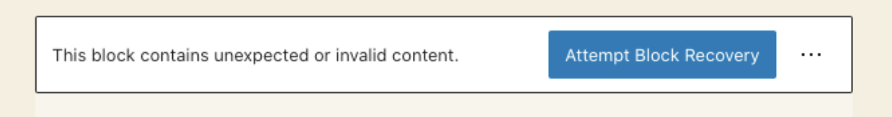

## **Handling Block Versioning and Deprecation**

### **Why Deprecate a Block?**

During editor initialization, there’s a [block markup validation process](https://developer.wordpress.org/block-editor/reference-guides/block-api/block-edit-save/#validation), where the saved markup for each block is regenerated using the attributes that were parsed from the post’s content. If the newly-generated markup does not match what was already stored in post content, the block is marked as invalid. This is because the block editor assumes that unless the user makes edits, the markup should remain identical to the saved content.

So when the `save` function output of a block changes, existing instances of that block in posts or pages might become invalid. This happens because the saved content no longer matches the block's updated `save` function, leading to validation errors in the editor, displaying messages like "This block contains unexpected or invalid content."



To prevent such issues, WordPress provides a mechanism called block deprecation. Deprecation allows developers to define older versions of a block, enabling the editor to recognize and update legacy content without errors.

Deprecating old versions of a block is important because:

- **Preserves existing content**: Ensures that previously created content continues to display correctly.
- **Enables smooth updates**: Allows developers to improve blocks without breaking user sites.
- **Maintains user trust**: Prevents frustration caused by sudden content breakages.

By defining deprecated versions of a block, WordPress can match and transform older block structures

Note: For those blocks which save function is null (dynamic blocks), the Block Editor skips the [block markup validation process](https://developer.wordpress.org/block-editor/reference-guides/block-api/block-edit-save/#validation), avoiding issues with frequently changing markup.

## Implementing Block Deprecations

To implement a block deprecation, you'll need to add a `deprecated` array to your block registration. Each item in this array represents a previous version of the block.

#### **Basic Deprecation**

When updating a block, provide the older versions inside the `deprecated` array.

```javascript
import { registerBlockType } from "@wordpress/blocks";
import metadata from "./block.json";

registerBlockType(metadata.name, {
  attributes: {
    content: { type: "string", default: "" },
    alignment: { type: "string", default: "left" },
  },
  edit: () => {
    /* Block Editor UI */
  },
  save: (props) => {
    return (
      <p style={{ textAlign: props.attributes.alignment }}>
        {props.attributes.content}
      </p>
    );
  },

  deprecated: [
    {
      attributes: {
        content: { type: "string" },
      },
      save: ({ attributes }) => {
        return <p>{attributes.content}</p>;
      },
    },
  ],
});
```

In this example, the deprecated version of the block does not include the `alignment` attribute. This ensures that when users open older posts, WordPress can still recognize the older structure and migrate it properly.

.

### Multiple Deprecations

For blocks with multiple deprecations, it's often clearer to define each version separately:

```javascript
import { registerBlockType } from "@wordpress/blocks";
import metadata from "./block.json";

const v1 = {
  /* v1 attributes */
  attributes: {
    title: { type: "string" },
    content: { type: "string" },
  },
  /* v1 save function */
  save: (props) => {
    return (
      <p>
        <em>{props.attributes.content}</em>
      </p>
    );
  },
};

const v2 = {
  /* v2 attributes */
  attributes: {
    title: { type: "string" },
    body: { type: "string" }, // Renamed 'content' to 'body'
  },
  /* v2 save function */
  save: (props) => {
    return <p>{props.attributes.body}</p>;
  },
};

const v3 = {
  /* v3 attributes */
  attributes: {
    headline: { type: "string" }, // Renamed 'title' to 'headline'
    body: { type: "string" },
  },
  /* v3 save function */
  save: (props) => {
    return <h2>{props.attributes.headline}</h2>;
  },
};

const deprecated = [v3, v2, v1]; // Note the reverse chronological order

registerBlockType(metadata.name, {
  attributes: {
    headline: { type: "string" },
    body: { type: "string" },
  },
  edit: () => {
    /* Block Editor UI */
  },

  save: (props) => {
    return (
      <div>
        <h1>{props.attributes.headline}</h1>
        <p>{props.attributes.body}</p>
      </div>
    );
  },
  deprecated,
});
```

This approach allows the block editor to attempt the most recent deprecations first, optimizing performance

Check out a [live demo](https://playground.wordpress.net/?blueprint-url=https://raw.githubusercontent.com/Automattic/wpvip-learn-enterprise-block-editor/refs/heads/trunk/examples/deprecation/_playground/blueprint.json) of this example and the [complete code](https://github.com/Automattic/wpvip-learn-enterprise-block-editor/tree/trunk/examples/deprecation) of the basic and multiple deprecation examples above

## **Strategies for Maintaining Backward Compatibility**

### **Attribute Migration**

If an attribute needs to be renamed, WordPress provides a way to map deprecated attribute names to new ones using a `migrate` function.

#### **Example: Renaming an Attribute**

```javascript
const v2 = {
  attributes: {
    title: { type: "string" },
    content: { type: "string" },
  },
  migrate: (attributes) => {
    return {
      headline: attributes.title, // Renaming 'title' to 'headline'
      body: attributes.content, // Renaming 'content' to 'body'
    };
  },
  save: (props) => {
    return <h2>{props.attributes.headline}</h2>;
  },
};
```

This migration ensures that old blocks using `title` and `content` are seamlessly transitioned to `headline` and `body` without breaking.

### **Migrating Blocks with Inner Blocks**

Sometimes, a block’s structure changes to include or remove inner blocks. When this happens, older versions must be converted properly.

#### **Example: Adding an Inner Block**

If we initially had a block storing text as an attribute but later want to include it as a child block:

##### **Initial Version**

```javascript
const v1 = {
  attributes: {
    content: { type: "string" },
  },
  save: (props) => {
    return <p>{props.attributes.content}</p>;
  },
};
```

##### **Updated Version with Inner Blocks**

```javascript
const v2 = {
  supports: {
    innerBlocks: true,
  },
  save: () => {
    return <InnerBlocks.Content />;
  },
  migrate: (attributes) => {
    return {
      innerBlocks: [
        {
          name: "core/paragraph",
          attributes: { content: attributes.content },
        },
      ],
    };
  },
};
```

In this example, existing content from `content` is migrated into an inner paragraph block, ensuring smooth transitions.

## **Addressing Block Validation Errors**

When a block’s `save` function output does not match the stored content, the Block Editor triggers a validation error. This usually happens when:

- The `save` function is modified without a corresponding deprecation.
- Attributes are changed without a migration strategy.
- Inner block structures are altered without proper migration.

### **Steps to Prevent Validation Errors:**

1. **Use the Deprecation API** – Define deprecated versions whenever changes are made to a block’s save function or structure.
2. **Ensure the `save` output is consistent** – Older versions should retain the same markup to match saved content.
3. **Test deprecated versions** – Load older content in the editor and verify that it upgrades correctly.
4. **Use migrations for attributes and inner blocks** – When modifying attributes or converting content into inner blocks, always provide a migration path.

For more information, see the [WordPress Block Validation Guide](https://developer.wordpress.org/block-editor/reference-guides/block-api/block-edit-save/#validation) and the [Block Deprecation Guide](https://developer.wordpress.org/block-editor/reference-guides/block-api/block-deprecation/).

---

## **Conclusion**

Handling block deprecations properly ensures that blocks remain backward-compatible, preventing validation errors and preserving user content. By defining multiple deprecated versions, using the migration function when necessary, and keeping the `save` output consistent, you can ensure a smooth transition for users as your blocks evolve.
