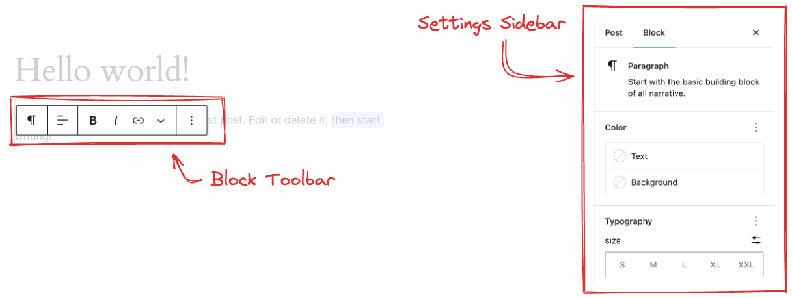

# 6.1: Custom Block Controls

## Purpose and Functionality of Custom Block Controls

The [WordPress Block Editor](https://developer.wordpress.org/block-editor/) (Gutenberg) provides two primary interfaces for customizing blocks: the **Settings Sidebar** and the **Block Toolbar**. These components allow users to modify and configure blocks without cluttering the main content area.



### Settings Sidebar

The Settings Sidebar appears on the right side of the editor and contains collapsible panels that provide access to various block settings. It serves as the control center for block configuration, allowing users to:

- Adjust block-specific settings and properties
- Configure advanced options like spacing, typography, and colors
- Set custom attributes that affect the block's behavior
- Manage block metadata and additional settings

### Block Toolbar

The Block Toolbar appears above a selected block and provides quick access to commonly used actions and settings. It allows users to:

- Format content with buttons for text styling (bold, italic, etc.)
- Align content within the block
- Perform block-specific actions
- Access additional options through dropdown menus

## Enhancing the Block Editing Experience

Custom sidebar panels and toolbar controls significantly improve the user experience by:

1. **Organizing Settings Logically**: Grouping related options in collapsible panels makes complex blocks easier to configure.
2. **Separating Content from Configuration**: Keeping formatting options in the toolbar and advanced settings in the sidebar creates a cleaner editing interface.
3. **Providing Context-Specific Controls**: Showing only relevant options based on block type and current state reduces cognitive load.
4. **Improving Workflow Efficiency**: Adding frequently used actions to the toolbar speeds up content creation.
5. **Enabling Advanced Customization**: Custom controls allow users to create precisely tailored content without writing code.

## Creating Custom Sidebar Panels with InspectorControls

The [`InspectorControls`](https://github.com/WordPress/gutenberg/blob/HEAD/packages/block-editor/src/components/inspector-controls/README.md) component from [`@wordpress/block-editor`](https://developer.wordpress.org/block-editor/reference-guides/packages/packages-block-editor/) allows developers to add custom settings panels to the block sidebar. Here's how to implement it:

```javascript
import { __ } from "@wordpress/i18n";
import { InspectorControls, useBlockProps } from "@wordpress/block-editor";
import { PanelBody, TextControl, ToggleControl } from "@wordpress/components";

export default function Edit({ attributes, setAttributes }) {
  const { showDate, customText } = attributes;

  return (
    <>
      <InspectorControls>
        <PanelBody
          title={__("Content Settings", "my-plugin")}
          initialOpen={true}
        >
          <ToggleControl
            label={__("Show Date", "my-plugin")}
            checked={showDate}
            onChange={() => setAttributes({ showDate: !showDate })}
          />
          <TextControl
            label={__("Custom Text", "my-plugin")}
            value={customText}
            onChange={(value) => setAttributes({ customText: value })}
          />
        </PanelBody>
      </InspectorControls>
      <div {...useBlockProps()}>
        {/* Block content here */}
        {showDate && <p>{new Date().toLocaleDateString()}</p>}
        {customText && <p>{customText}</p>}
      </div>
    </>
  );
}
```

Key components for creating effective sidebar panels:

1. [`PanelBody`](https://developer.wordpress.org/block-editor/reference-guides/components/panel/#panelbody): Creates a collapsible section for related settings
2. [`TextControl`](https://developer.wordpress.org/block-editor/reference-guides/components/text-control/): Provides input fields for text-based attributes
3. [`ToggleControl`](https://developer.wordpress.org/block-editor/reference-guides/components/toggle-control/): Adds toggle switches for boolean options
4. [`ColorPicker`](https://developer.wordpress.org/block-editor/reference-guides/components/color-picker/): Enables color selection for styling options
5. [`RangeControl`](https://developer.wordpress.org/block-editor/reference-guides/components/range-control/): Allows numerical input within a specified range

> [!NOTE]
> This [Build your first block](https://developer.wordpress.org/block-editor/getting-started/tutorial/) tutorial explains how to create a custom block with an Inspector Controls panel. Check the [code](https://github.com/WordPress/block-development-examples/tree/trunk/plugins/copyright-date-block-09aac3) and its [live preview](https://playground.wordpress.net/?blueprint-url=https://raw.githubusercontent.com/WordPress/block-development-examples/trunk/plugins/copyright-date-block-09aac3/_playground/blueprint.json).

## Creating Custom Block Toolbar Controls

To add custom buttons to the block toolbar, use the [`BlockControls`](https://developer.wordpress.org/block-editor/reference-guides/packages/packages-editor/#blockcontrols) component from [`@wordpress/block-editor`](https://developer.wordpress.org/block-editor/reference-guides/packages/packages-editor/):

```javascript
import { __ } from "@wordpress/i18n";
import { BlockControls } from "@wordpress/editor";
import { useBlockProps } from "@wordpress/block-editor";
import { ToolbarButton, ToolbarGroup } from "@wordpress/components";
import { formatBold } from "@wordpress/icons";

export default function Edit({ attributes, setAttributes }) {
  const { isBold } = attributes;

  const toggleBold = () => {
    setAttributes({ isBold: !isBold });
  };

  return (
    <>
      <BlockControls>
        <ToolbarGroup>
          <ToolbarButton
            icon={formatBold}
            title={__("Bold Text", "my-plugin")}
            isActive={isBold}
            onClick={toggleBold}
          />
        </ToolbarGroup>
      </BlockControls>
      <div {...useBlockProps()}>
        <p style={{ fontWeight: isBold ? "bold" : "normal" }}>
          {/* Block content here */}
          This is my custom block content.
        </p>
      </div>
    </>
  );
}
```

Best practices for implementing toolbar controls:

1. Group related controls using [`ToolbarGroup`](https://developer.wordpress.org/block-editor/reference-guides/components/toolbar-group/)
2. Use [WordPress icons](https://developer.wordpress.org/block-editor/reference-guides/packages/packages-icons/) for consistency with the editor interface
3. Keep the toolbar focused on the most commonly used actions
4. Implement `isActive` state to show active selections
5. Provide descriptive labels with proper [translations](https://developer.wordpress.org/block-editor/how-to-guides/internationalization/)

> [!NOTE]
> This [Block Toolbar Controls](https://github.com/WordPress/block-development-examples/tree/trunk/plugins/block-toolbar-ab967f) example in the `block-development-examples` repo illustrates how to add a block toolbar to a custom block.

## Modifying Existing Blocks to Add Inspector Controls

The WordPress Block Editor allows developers to extend existing blocks with additional settings using the [`editor.BlockEdit`](https://developer.wordpress.org/block-editor/reference-guides/filters/block-filters/#editor-blockedit) filter. This is particularly useful for adding custom functionality to core blocks without modifying their source code.

To modify an existing block's inspector controls:

```javascript
import { addFilter } from "@wordpress/hooks";
import { createHigherOrderComponent } from "@wordpress/compose";
import { InspectorControls } from "@wordpress/block-editor";
import { PanelBody, TextControl } from "@wordpress/components";
import { Fragment } from "@wordpress/element";

// Create a higher-order component to enhance the block
const withCustomInspectorControls = createHigherOrderComponent((BlockEdit) => {
  return (props) => {
    // Only apply to paragraph blocks
    if (props.name !== "core/paragraph") {
      return <BlockEdit {...props} />;
    }

    const { attributes, setAttributes } = props;
    const { customAttribute } = attributes;

    return (
      <Fragment>
        <BlockEdit {...props} />
        <InspectorControls>
          <PanelBody title="Custom Settings" initialOpen={true}>
            <TextControl
              label="Custom Attribute"
              value={customAttribute || ""}
              onChange={(value) => setAttributes({ customAttribute: value })}
            />
          </PanelBody>
        </InspectorControls>
      </Fragment>
    );
  };
}, "withCustomInspectorControls");

// Register attributes for the core paragraph block
const addCustomAttributes = (settings, name) => {
  if (name !== "core/paragraph") {
    return settings;
  }

  return {
    ...settings,
    attributes: {
      ...settings.attributes,
      customAttribute: {
        type: "string",
        default: "",
      },
    },
  };
};

// Add the custom attribute
addFilter(
  "blocks.registerBlockType",
  "my-plugin/add-custom-attributes",
  addCustomAttributes
);

// Add the custom inspector controls
addFilter(
  "editor.BlockEdit",
  "my-plugin/with-custom-inspector-controls",
  withCustomInspectorControls
);
```

This approach uses:

1. [`addFilter`](https://developer.wordpress.org/block-editor/reference-guides/packages/packages-hooks/#addfilter) to hook into WordPress's filter system
2. [`createHigherOrderComponent`](https://developer.wordpress.org/block-editor/reference-guides/packages/packages-compose/#createhigherordercomponent) to wrap the original BlockEdit component
3. A condition to target only specific block types
4. Addition of new attributes to store the custom settings

> [!NOTE]
> The [block-filters-inspector-controls](https://github.com/Automattic/wpvip-learn-enterprise-block-editor/tree/trunk/examples/block-filters-inspector-controls) ([live demo](https://playground.wordpress.net/?blueprint-url=https://raw.githubusercontent.com/Automattic/wpvip-learn-enterprise-block-editor/refs/heads/trunk/examples/block-filters-inspector-controls/_playground/blueprint.json)) example illustrates how to add sidebar panel to an existing block.

## Modifying Existing Blocks to Add Block Controls

Similar to adding inspector controls, you can enhance existing blocks with custom toolbar controls:

```javascript
import { addFilter } from "@wordpress/hooks";
import { createHigherOrderComponent } from "@wordpress/compose";
import { BlockControls } from "@wordpress/block-editor";
import { ToolbarButton } from "@wordpress/components";
import { Fragment } from "@wordpress/element";
import { formatUppercase } from "@wordpress/icons";

// Create a higher-order component to add toolbar controls
const withCustomToolbarControls = createHigherOrderComponent((BlockEdit) => {
  return (props) => {
    // Only apply to heading blocks
    if (props.name !== "core/heading") {
      return <BlockEdit {...props} />;
    }

    const { attributes, setAttributes } = props;
    const { isUppercase } = attributes;

    const toggleUppercase = () => {
      setAttributes({ isUppercase: !isUppercase });
    };

    return (
      <Fragment>
        <BlockControls>
          <ToolbarButton
            icon={formatUppercase}
            title="Toggle Uppercase"
            isActive={isUppercase}
            onClick={toggleUppercase}
          />
        </BlockControls>
        <BlockEdit {...props} />
      </Fragment>
    );
  };
}, "withCustomToolbarControls");

// Register attributes for the core heading block
const addCustomBlockAttributes = (settings, name) => {
  if (name !== "core/heading") {
    return settings;
  }

  return {
    ...settings,
    attributes: {
      ...settings.attributes,
      isUppercase: {
        type: "boolean",
        default: false,
      },
    },
  };
};

// Apply the custom attribute
addFilter(
  "blocks.registerBlockType",
  "my-plugin/add-custom-block-attributes",
  addCustomBlockAttributes
);

// Add the custom toolbar controls
addFilter(
  "editor.BlockEdit",
  "my-plugin/with-custom-toolbar-controls",
  withCustomToolbarControls
);

// Transform the block output
const applyCustomStyle = createHigherOrderComponent((BlockListBlock) => {
  return (props) => {
    if (props.name !== "core/heading") {
      return <BlockListBlock {...props} />;
    }

    const { attributes } = props;
    const { isUppercase } = attributes;

    let wrapperProps = props.wrapperProps || {};
    wrapperProps = {
      ...wrapperProps,
      style: {
        ...wrapperProps.style,
        textTransform: isUppercase ? "uppercase" : undefined,
      },
    };

    return <BlockListBlock {...props} wrapperProps={wrapperProps} />;
  };
}, "applyCustomStyle");

// Apply the custom style to the block in the editor
addFilter(
  "editor.BlockListBlock",
  "my-plugin/apply-custom-style",
  applyCustomStyle
);
```

This approach:

1. Adds custom toolbar buttons to specific blocks
2. Registers new attributes to store button states
3. Includes a third filter to apply visual styling based on the custom settings
4. Implements proper toggling of the active state

## Conclusion

Custom panels and inspectors significantly enhance the WordPress Block Editor by providing intuitive interfaces for block configuration. By creating custom sidebar panels and toolbar controls, developers can:

1. Improve the editing experience with context-specific settings
2. Maintain a clean, uncluttered interface by organizing options logically
3. Provide advanced customization options without requiring users to write code
4. Extend core blocks with additional functionality

Using the [WordPress Block Editor API](https://developer.wordpress.org/block-editor/reference-guides/block-api/) to implement these customizations ensures compatibility with future WordPress updates and provides a consistent experience for users. By following the examples and best practices outlined in this lesson, you can create powerful, user-friendly blocks that enhance the content creation experience.

## Further Reading

- [Block Editor Handbook](https://developer.wordpress.org/block-editor/)
- [Block API Reference](https://developer.wordpress.org/block-editor/reference-guides/block-api/)
- [Components Reference](https://developer.wordpress.org/block-editor/reference-guides/components/)
- [SlotFills Reference](https://developer.wordpress.org/block-editor/reference-guides/slotfills/)
- [Filters Reference](https://developer.wordpress.org/block-editor/reference-guides/hooks/block-filters/)
- [Plugin Sidebar](https://developer.wordpress.org/block-editor/how-to-guides/plugin-sidebar-0/)
