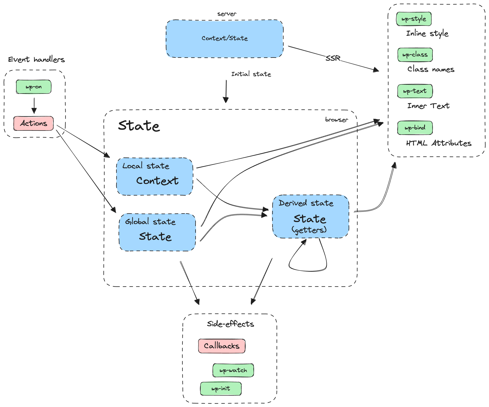

# Implementing the Interactivity API

The [WordPress Interactivity API](https://developer.wordpress.org/block-editor/reference-guides/interactivity-api/) introduces a powerful framework for creating dynamic, interactive blocks. This lesson will explore key concepts and techniques for implementing the Interactivity API effectively.

> [!NOTE]
> Check [The Reactive and Declarative mindset](https://developer.wordpress.org/block-editor/reference-guides/interactivity-api/core-concepts/the-reactive-and-declarative-mindset/) docs page from the Interactivity API docs for more examples and info about this topic

To add dynamic behaviour in the frontend using the Interactivity API, developers can use:

- **[Directives](https://developer.wordpress.org/block-editor/reference-guides/interactivity-api/api-reference/#list-of-directives)**: Added to the markup to control the behavior of elements.
- **[Store](https://developer.wordpress.org/block-editor/reference-guides/interactivity-api/api-reference/#the-store)**: Manages logic and data (such as state, actions, and side effects) needed for interactivity.

Directives connect DOM elements to data in the state and context. When the data changes, the directives automatically update the DOM, ensuring a dynamic and responsive experience (see [diagram](https://excalidraw.com/#json=T4meh6lltJh6TCX51NTIu,DmIhxYSGFTL_ywZFbsmuSw)).



## **Directives**

Directives are special attributes you can add to your block's markup to control how its elements behave. For dynamic blocks, you add them in the `render.php` file, and for static blocks, you use the `save.js` file.

Example:

```javascript
<div
  data-wp-interactive="myPlugin"
  data-wp-context='{ "isOpen": false }'
  data-wp-watch="callbacks.logIsOpen"
>
  <button
    data-wp-on--click="actions.toggle"
    data-wp-bind--aria-expanded="context.isOpen"
    aria-controls="p-1"
  >
    Toggle
  </button>

  <p id="p-1" data-wp-bind--hidden="!context.isOpen">
    This element is now visible!
  </p>
</div>
```

The value assigned to a directive is a string pointing to a specific state, action, or side effect from a store.

> [!NOTE]
> The list of directives and a detailed description of each one is available in the [API Reference](https://developer.wordpress.org/block-editor/reference-guides/interactivity-api/api-reference/#list-of-directives)

### Directives for setting a "scope"

These directives define a specific scope for a DOM element and its children:

- [`wp-interactive`](https://developer.wordpress.org/block-editor/reference-guides/interactivity-api/api-reference/#wp-interactive): Activates interactivity for an element and its children, associating them with a store's namespace and providing access to it.
- [`wp-context`](https://developer.wordpress.org/block-editor/reference-guides/interactivity-api/api-reference/#wp-context): Defines a local state that can be accessed by child elements.

### Directives to manipulate attributes

These directives manipulate attributes, classes, and styles based on boolean expressions.

- [`wp-bind`](https://developer.wordpress.org/block-editor/reference-guides/interactivity-api/api-reference/#wp-bind): Dynamically sets attributes on an element (`data-wp-bind--hidden="!context.isOpen"`).
- [`wp-class`](https://developer.wordpress.org/block-editor/reference-guides/interactivity-api/api-reference/#wp-class): Adds or removes a class based on a boolean value (`data-wp-class--selected="context.isSelected"`).
- [`wp-style`](https://developer.wordpress.org/block-editor/reference-guides/interactivity-api/api-reference/#wp-style): Dynamically applies inline styles (`data-wp-style--color="context.color"`).

### Directives for event handling

These directives execute actions in response to events.

- [`wp-on`](https://developer.wordpress.org/block-editor/reference-guides/interactivity-api/api-reference/#wp-on): Attaches event listeners to elements (`data-wp-on--click="actions.toggleMenu"`).
- [`wp-on-async`](https://developer.wordpress.org/block-editor/reference-guides/interactivity-api/api-reference/#wp-on-async): A more performant version of `wp-on`, yielding control back to the main thread.
- [`wp-on-window`](https://developer.wordpress.org/block-editor/reference-guides/interactivity-api/api-reference/#wp-on-window): Attaches global window event listeners (`data-wp-on-window--resize="callbacks.logWidth"`).
- [`wp-on-async-window`](https://developer.wordpress.org/block-editor/reference-guides/interactivity-api/api-reference/#wp-on-async-window): Optimized version of `wp-on-window`.
- [`wp-on-document`](https://developer.wordpress.org/block-editor/reference-guides/interactivity-api/api-reference/#wp-on-document): Listens for document-wide events (`data-wp-on-document--keydown="callbacks.logKeydown"`).
- [`wp-on-async-document`](https://developer.wordpress.org/block-editor/reference-guides/interactivity-api/api-reference/#wp-on-async-document): Optimized version of `wp-on-document`.

### Directives for Text and Content Manipulation

These directives modify content dynamically.

- [`wp-text`](https://developer.wordpress.org/block-editor/reference-guides/interactivity-api/api-reference/#wp-text): Sets the inner text of an element (`data-wp-text="context.text"`).

### Directives for Side Effects and Lifecycle Hooks

These directives execute callbacks in response to state changes or lifecycle events.

- [`wp-watch`](https://developer.wordpress.org/block-editor/reference-guides/interactivity-api/api-reference/#wp-watch): Runs a callback when a node is created and whenever its state/context changes.
- [`wp-init`](https://developer.wordpress.org/block-editor/reference-guides/interactivity-api/api-reference/#wp-init): Executes a callback only once when a node is created.
- [`wp-run`](https://developer.wordpress.org/block-editor/reference-guides/interactivity-api/api-reference/#wp-run): Executes a callback during the render cycle, allowing the use of hooks.

### Directives for Dynamic Lists and Keys

These directives manage list rendering and key-based identification.

- [`wp-key`](https://developer.wordpress.org/block-editor/reference-guides/interactivity-api/api-reference/#wp-key): Assigns a unique key to an element to optimize re-rendering.
- [`wp-each`](https://developer.wordpress.org/block-editor/reference-guides/interactivity-api/api-reference/#wp-each): Loops over an array and renders a list of elements.
- [`wp-each-child`](https://developer.wordpress.org/block-editor/reference-guides/interactivity-api/api-reference/#wp-each-child): Ensures hydration works correctly for server-rendered lists.

## **The Store**

[The store](https://developer.wordpress.org/block-editor/reference-guides/interactivity-api/api-reference/#the-store) is a fundamental concept in the Interactivity API that serves as the central hub for managing state and logic in your blocks. It is used to create the logic (actions, side effects, etc.) linked to the directives and the data used inside that logic (state, derived state, etc.).

The store is responsible for:

- Managing the state (data) of your blocks
- Handling actions (functions that modify state)
- Managing side effects (reactions to state changes)
- Computing derived state (calculated values based on state)

By convention, the store is typically created in the view.js file of your block, though you can initialize some state from the render.php file as well.

### Elements of the store

#### State

The store supports two types of state:

**Global State**

- Defined using the `store()` function with the `state` property
- Accessible to all HTML nodes in the page
- Useful for sharing data across multiple blocks or components

**Context/Local State**

- Defined using the `data-wp-context` directive in HTML nodes
- Scoped to the specific node and its children
- Ideal for component-specific data

Here's how both types of state can be used together:

```
<!-- Example of using both global and local state -->
<div data-wp-context='{ "itemName": "Sample Item" }'>
	<!-- Access global state -->
	<span data-wp-text="state.globalCounter"></span>

	<!-- Access local state (context) -->
	<span data-wp-text="context.itemName"></span>
</div>
```

```javascript
const { state } = store("myPlugin", {
  state: {
    globalCounter: 0,
  },
});
```

> [!INFO]
> Check the following lesson [Global, Local and Derived state](#) for more detailed info about this topic

#### Actions

[Actions](https://developer.wordpress.org/block-editor/reference-guides/interactivity-api/api-reference/#elements-of-the-store) are functions that modify state or perform operations. They can be:

- Triggered by directives like `data-wp-on`
- Called from other actions
- [Synchronous](https://developer.mozilla.org/en-US/docs/Glossary/Synchronous) or [asynchronous](https://developer.mozilla.org/en-US/docs/Glossary/Asynchronous)

```javascript
const { state, actions } = store("myPlugin", {
  actions: {
    increment: () => {
      state.globalCounter++;
    },
    complexAction: () => {
      // Actions can call other actions
      actions.increment();
      // And access context
      const context = getContext();
      console.log(context.itemName);
    },
  },
});
```

##### Handling Asynchronous Operations

For asynchronous operations, the Interactivity API requires using [generators](https://developer.mozilla.org/en-US/docs/Web/JavaScript/Reference/Global_Objects/Generator) instead of [async/await](https://developer.mozilla.org/en-US/docs/Web/JavaScript/Reference/Statements/async_function). This is crucial for maintaining proper scope and context throughout asynchronous operations. Here's why and how to do it:

```javascript
const { actions } = store("myPlugin", {
  actions: {
    // ❌ Don't use async/await
    async wrongWayToFetch() {
      const response = await fetch("/api/data");
      const data = await response.json();
      state.data = data;
    },

    // ✅ Use generators instead
    *correctWayToFetch() {
      const response = yield fetch("/api/data");
      const data = yield response.json();
      state.data = data;
    },
  },
});
```

The [generator function](https://developer.mozilla.org/en-US/docs/Web/JavaScript/Reference/Statements/function*) approach ensures that the store can properly track and restore scope when async operations resume. This is particularly important when dealing with context-dependent actions.

##### Synchronous Event Handling

Some actions require synchronous access to the [Event object](https://developer.mozilla.org/en-US/docs/Web/API/Event), particularly when using methods like:

- [`event.preventDefault()`](https://developer.mozilla.org/en-US/docs/Web/API/Event/preventDefault)
- [`event.stopPropagation()`](https://developer.mozilla.org/en-US/docs/Web/API/Event/stopPropagation)
- [`event.stopImmediatePropagation()`](https://developer.mozilla.org/en-US/docs/Web/API/Event/stopImmediatePropagation)

For these cases, you must use the `withSyncEvent` utility:

```javascript
import { store, withSyncEvent } from "@wordpress/interactivity";

const { actions } = store("myPlugin", {
  actions: {
    // ✅ Use withSyncEvent when you need synchronous event access
    handleSubmit: withSyncEvent(function* (event) {
      // Prevent form submission
      event.preventDefault();

      // Perform async operation
      yield submitData();

      // Split long tasks to avoid blocking
      yield splitTask();

      // Continue processing
      processResult();
    }),

    // ❌ Don't use withSyncEvent when not needed
    simpleClick: (event) => {
      console.log("Clicked:", event.target);
    },
  },
});
```

#### Side Effects

Side effects are functions that automatically react to state changes. They're particularly useful for:

- Syncing state with external systems
- Performing operations when state changes
- Managing subscriptions or cleanup

```javascript
const { callbacks } = store("myPlugin", {
  callbacks: {
    onCounterChange: () => {
      const { globalCounter } = state;
      console.log(`Counter changed to: ${globalCounter}`);
    },
  },
});
```

##### Asynchronous Side Effects

Like actions, side effects can also handle asynchronous operations using [generators](https://developer.mozilla.org/en-US/docs/Web/JavaScript/Reference/Global_Objects/Generator). This is particularly useful when working with [Fetch API](https://developer.mozilla.org/en-US/docs/Web/API/Fetch_API) or other async operations:

```javascript
const { callbacks } = store("myPlugin", {
  callbacks: {
    *syncWithServer() {
      // Get current state
      const { data } = state;

      try {
        // Send data to server using Fetch API
        const response = yield fetch("/api/sync", {
          method: "POST",
          body: JSON.stringify(data),
        });

        // Handle response
        if (!response.ok) {
          throw new Error("Sync failed");
        }

        // Update state with server response
        const result = yield response.json();
        state.lastSyncTime = result.timestamp;
      } catch (error) {
        state.syncError = error.message;
      }
    },
  },
});
```

##### Effect Cleanup

Side effects can return a cleanup function that will be called before the effect runs again or when the component is removed. This is particularly useful when working with [WebSocket](https://developer.mozilla.org/en-US/docs/Web/API/WebSocket) connections or [Event Listeners](https://developer.mozilla.org/en-US/docs/Web/API/EventTarget/addEventListener):

```javascript
const { callbacks } = store("myPlugin", {
  callbacks: {
    *initializeWebSocket() {
      const ws = new WebSocket("wss://api.example.com");

      // Set up event handlers
      ws.addEventListener("message", handleMessage);

      // Return cleanup function
      return () => {
        ws.removeEventListener("message", handleMessage);
        ws.close();
      };
    },
  },
});
```

#### Derived State

Derived state represents computed values based on other state values. It's defined using getters in the state object:

```javascript
const { state } = store("myPlugin", {
  state: {
    price: 100,
    taxRate: 0.2,
    get totalWithTax() {
      return state.price * (1 + state.taxRate);
    },
  },
});
```

## Using the iAPI on core and third-party blocks

The Interactivity API can be used to enhance both core WordPress blocks and third-party blocks. This section explores how to implement interactive features on existing blocks using the HTML API to add directives and custom JavaScript to handle the interactive behavior.

### Adding Interactivity to Core Blocks

To add interactivity to core blocks, we need to:

1. Use the [HTML API](https://make.wordpress.org/core/2023/03/07/introducing-the-html-api-in-wordpress-6-2/) to add directives to the block's markup
2. Create a custom store with the logic referenced in those directives

Here's a complete example of adding play/stop functionality to a core button block:

```php
// render.php
function render_block_core_button($block_content, $block) {
    // Only modify blocks with specific class
    if (!isset($block['attrs']['className']) ||
        !str_contains($block['attrs']['className'], 'interactive-block--button-play')) {
        return $block_content;
    }

    $processor = new WP_HTML_Tag_Processor($block_content);

    // Find the first tag (button)
    if ($processor->next_tag()) {
        // Add click handler
        $processor->set_attribute('data-wp-on--click', 'actions.playOrStop');
    }

    // Find the link tag inside the button
    if ($processor->next_tag(['tag_name' => 'a'])) {
        // Add dynamic text
        $processor->set_attribute('data-wp-text', 'context.buttonText');
    }

    return $processor->get_updated_html();
}
add_filter('render_block_core/button', 'render_block_core_button', 10, 2);
```

The corresponding JavaScript implementation that handles the interactive behavior:

```javascript
// view.js
import { store, getContext, getElement } from "@wordpress/interactivity";

store("elementary/media-text-interactive", {
  actions: {
    /**
     * Update the video play state.
     *
     * @return {void}
     */
    playOrStop() {
      const context = getContext();
      context.isPlaying = !context.isPlaying;
      context.buttonText = context.isPlaying ? "Stop" : "Play";
    },
  },
  callbacks: {
    /**
     * Play the video.
     *
     * @return {void}
     */
    playOrStopVideo() {
      const context = getContext();
      const { ref } = getElement();
      const video = ref.querySelector("video");

      if (video && context.isPlaying) {
        video.play();
      } else if (video) {
        video.pause();
      }
    },
  },
});
```

> [!NOTE]
> Check out [iapi-core-blocks-inner-blocks](https://github.com/Automattic/wpvip-learn-enterprise-block-editor/tree/trunk/examples/iapi-core-blocks-inner-blocks) (and its [live demo](https://playground.wordpress.net/?blueprint-url=https://raw.githubusercontent.com/Automattic/wpvip-learn-enterprise-block-editor/refs/heads/trunk/examples/iapi-core-blocks-inner-blocks/_playground/blueprint.json)) to see the full implementation of the example above.

### Best Practices

When extending existing blocks with the Interactivity API:

1. **Use HTML API for Safe Modifications**: The HTML API provides a reliable way to modify HTML markup and add directives.
2. **Conditional Processing**: Only modify blocks that meet specific criteria (e.g., have certain classes).
3. **Tag-Specific Processing**: Use `next_tag()` with parameters to target specific elements.
4. **Nested Element Handling**: Process parent and child elements separately.
5. **Namespace Your Store**: Use a unique namespace to avoid conflicts with other plugins or themes.
6. **Preserve Original Functionality**: Ensure your interactive enhancements don't break the block's original features.

> [!TIP]
> The Interactivity API uses Preact internally, allowing you to inspect frontend elements with [Preact Devtools](https://chromewebstore.google.com/detail/preact-developer-tools/ilcajpmogmhpliinlbcdebhbcanbghmd?hl=en). To enable this, set the `SCRIPT_DEBUG` PHP constant to true
